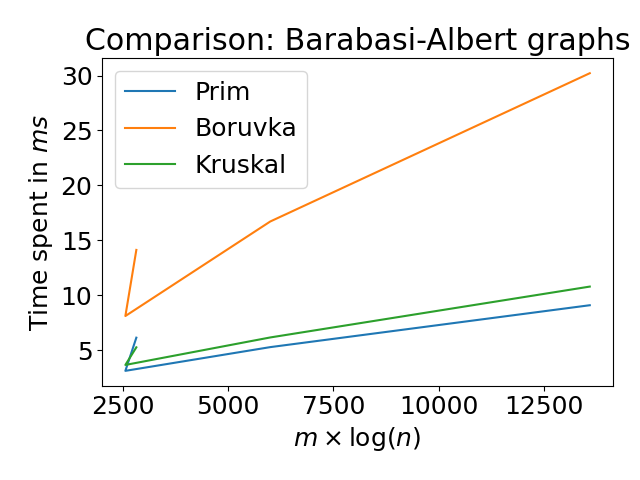
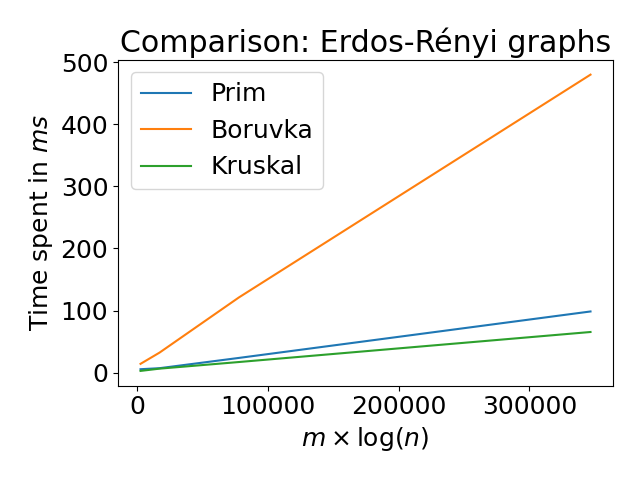
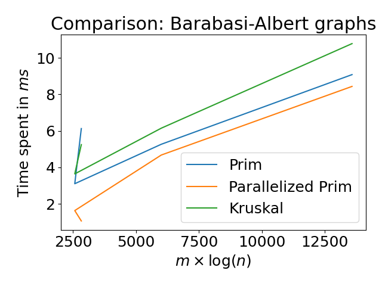
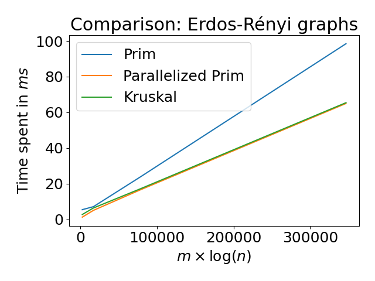
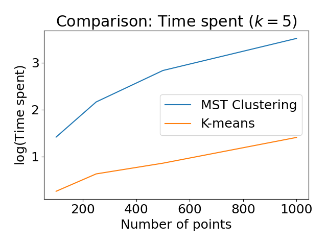
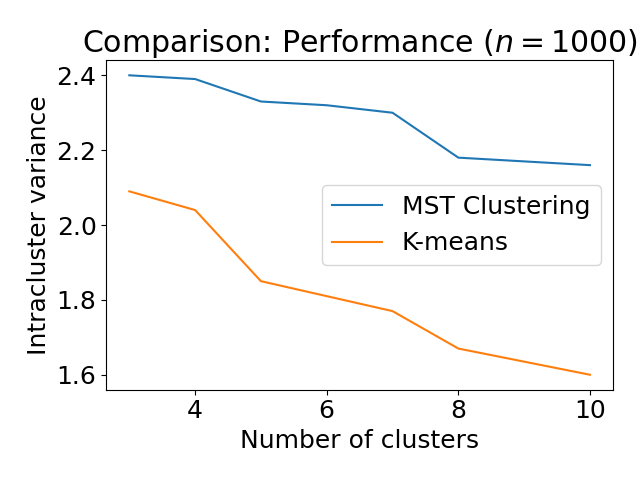
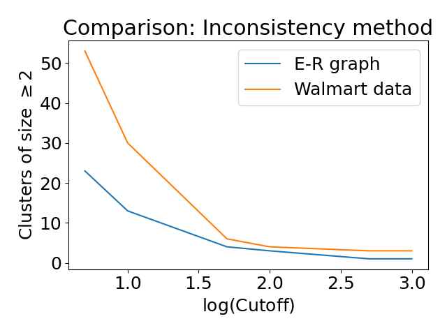

# Minimum Spanning Trees and Clustering 

In this project, we implement different Minimum Spanning Trees  (MST) algorithms, namely 
Boruvka, Prim and Kruskal algorithms. Also, we implement a parallelized version 
of Prim's algorithm with OpenMPI. Finally, we compute different clustering
techniques and we compare them to k-means. Thus, MST Clustering led us to 
interesting results, despite the fact MST algorithms have a high computation cost. 

Please refer to the following sections for more information:

1. [Usage](#package-usage)
2. [Documentation](#documentation)
3. [Results](#our-results)

This project was made in collaboration with another student from École Polytechnique.

## Package usage

### Compiling

To run the programs, we advise you to recompile from root folder. To do so,
you can type:

- `make clean`
- `make`

You will need a C++11-capable MPI compiler.

### Options

Then, in order to use the programs, go in the root folder. Here, you can
run the different algorithms by using following command: 

`build/main [options]`

- `-a` : runs Prim, Boruvka & Kruskal algorithms on generated graphs
- `-c` : runs a comparison between MST clustering and k-means
- `-i` : runs a comparison between Inconsistency clustering and k-means
- `-m` : runs Prim with MPI

The basic usage of `build/main` will not run the parallelized version of Prim's algorithm.
To do so, you need to complete the following command:

- `mpirun -np [number of cores] build/main -m`

### Tests

Also, there are tests available for all basic classes and some algorithms
in the *test/* folder. You can use the Makefile provided there to compile
them and run them separately.

## Documentation

A complete documentation is available in the *doc/* folder. If it is not
generated, you can run from root folder:

- `make doc`

Then, you can open index.html in your browser and follow the guide!

## Our results 

Here, we will describe our results on computing MST and MST Clustering. Firstly, 
we compare classic MST algorithms. Secondly, we add a parallelized version of Prim's 
algorithm and we compare its computation cost. Finally, we do some clustering with MST 
and we compare the results with the well-known k-means method.

### MST Algorithms 

Here, we show the computation cost for Boruvka, Prim and Kruskal algorithms. The generated 
graphs are following Barabasi-Albert and Erdos-Rényi rules.

From these experiments, we can confirm that the MST algorithms have a complexity in 
O(*m* log(*n*)) where *n* is the number of nodes and *m* is the number of edges. Also, 
Boruvka's algorithm seems to be more costful. However, it is mainly due to our implementation 
choices, because we compute several Union-Find data structures. 

### Parallelized Prim

Here, we show a comparison between parallelized Prim's algorithm and the previous algorithms. The results are obtained by using 4 cores.

In fact, we show that parallelized version of Prim outperforms the other algorithms.

### MST Clustering 

Firstly, the most simple way of performing clustering based on MST is to remove the 
*k*-1 edges with highest weights when we want *k* clusters. Here, we show a comparison of 
time complexity and intracluster variance between this technique and k-means.

More specifically, we see that MST Clustering is both most costful and less accurate than 
k-means in terms of intracluster variance. Thus, this explains why MST Clustering is not 
widely used in practice.

However, there exists a lot of other MST Clustering methods. For instance, we implement a 
method based on inconsistency. We define an edge as *inconsistent* when its weight is larger 
than a *cutoff* times the standard deviation of all edges connected to its both nodes. Here, we 
show the results for clusters of size at least 2, on Erdos-Rényi graphs and freely available 
Walmart markets data:

We notice that, one can compute an approximate number of clusters by choosing the *cutoff* value. Then, the Inconsistency method is able to discard a lot of outliers in clusters of size 1. Thus, MST Clustering allows to differentiate strong clusters from outliers.
